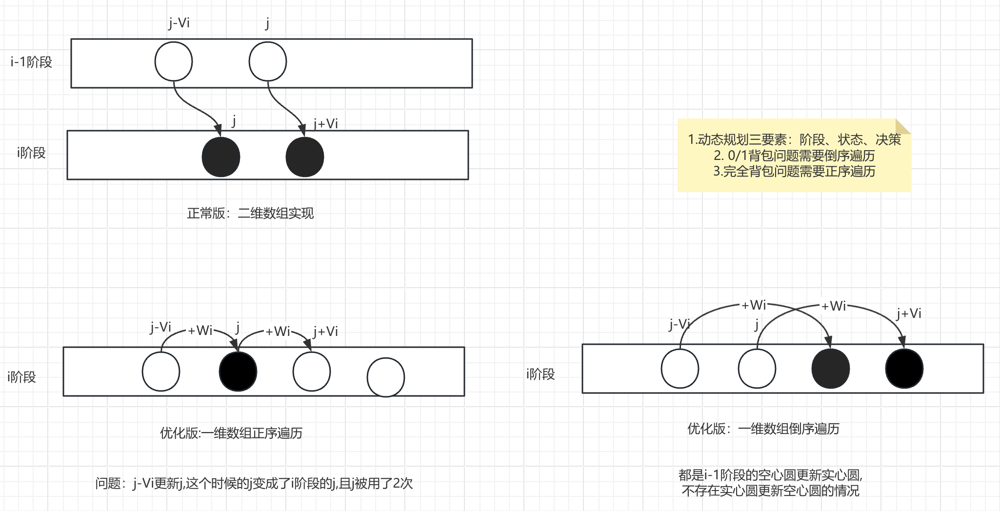

##### 买卖股票系列问题
[买卖股票的最佳时机](https://leetcode.cn/problems/best-time-to-buy-and-sell-stock/description/)<br/>
```
  dp[i] = Math.max(dp[i - 1], prices[i] - preMin[i]);
```
[买卖股票的最佳时机II](https://leetcode.cn/problems/best-time-to-buy-and-sell-stock-ii/description/)<br/>
```
  DP需要维护的状态：i:天数 j:持仓（0或1）有没有股票  k:交易次数 l:是否在冷冻期（0或1）
 
 f(i,j) 表示第i天结束时，持有j股股票(0或1)的最大收益
 决策：买、卖、啥也不干
 f[i][1] = max(f[i][1], f[i - 1][0] - prices[i]) 买 i-1天没股票，交出prices[i]的现金买股票，获得1的仓位
 f[i][0] = max(f[i][0], f[i - 1][1] + prices[i]) 卖 i-1天有股票，兑现获得prices[i]的现金，仓位变成0
 f[i][j] = max(f[i][j], f[i - 1][j])  啥也不干，只有时间推移
```
[买卖股票的最佳时机III](https://leetcode.cn/problems/best-time-to-buy-and-sell-stock-iii/description/)<br/>
[买卖股票的最佳时机IV](https://leetcode.cn/problems/best-time-to-buy-and-sell-stock-iv/description/)<br/>
```
  限定交易次数 最多次数为 k,在买、或卖的的时候记录交易次数，从k-1变成了k
  f(i,j,k) 表示第i天结束时,持有j股股票(0或1),已经交易了k次的最大收益
  
  f[i][1][k] = max(f[i][1][k], f[i - 1][0][k - 1] - prices[i]) // 买 i-1天没有股票 交易了k-1次 交钱获得股票资产 仓位增加 累加一次交易次数
  f[i][0][k] = max(f[i][0][k], f[i - 1][1][k] + prices[i]) //卖次数不用变 收入增加
  f[i][j][k] = max(f[i][j][k], f[i - 1][j][k])  //啥也不干 只有时间变化
```
[买卖股票的最佳时期含手续费](https://leetcode.cn/problems/best-time-to-buy-and-sell-stock-with-transaction-fee/description/)<br/>
```
  本题只是在买卖股票的最佳时机II的基础上,每次交易含手续费,可以在买的时候交手续费
```
[最佳买卖股票时机含冷冻期](https://leetcode.cn/problems/best-time-to-buy-and-sell-stock-with-cooldown/description/)<br/>
```
思路1：f[i][j][l] 该怎么计算?("谁能走到我")
   f[i][j][l] 表示第i天结束,持有j股股票(0或1),冷冻期状态为l(0-正常,1冷冻期)时的最大收益
   f[i][1][0] = Math.max(f[i][1][0], f[i - 1][0][0] - prices[i])  //买 i-1天没股票，交出prices[i]的现金买股票，获得1的仓位(买之前没有冷冻，买之后也没有冷冻)
   f[i][0][1] = Math.max(f[i][0][1], f[i - 1][1][0] + prices[i]) //卖 i-1天有股票，兑现获得prices[i]的现金，仓位变成0 (卖之前没有冷冻，买之后处于冷冻,具有一天的冷冻期)
   f[i][j][0] = Math.max(f[i][j][0], f[i - 1][j][l])  //啥也不干，只有时间推移 (无论之前是否处于冷冻期，之后必然解除冷冻期)

思路2：f[i][j][l] 能更新哪些状态?("我能走到谁") 列表法

思路3：用滚动数组做空间优化
& 1 等价于%2 （奇数变1 偶数变0）  &优先级小于+ -符号
如果把每个f(i)看作一行,那么转移只在相邻两行之间发生,这种情况下可以使用滚动数组优化
```
##### 复杂一些的线性DP实战
[打家劫舍](https://leetcode.cn/problems/house-robber/description/)<br/>
```
  f(i,j) 表示计划偷窃前i座房屋,第i座房屋的闯入情况为j(0-未闯入,1-闯入)时的最大收益
  f[i][0] = max(f[i - 1][0], f[i - 1][1]) //第i座房屋不偷，i-1偷或不偷都可以
  f[i][1] = f[i - 1][0] + nums[i] //第i座房屋偷，i-1不偷
  目标:max(f(n,0),f(n,1))
  
  同理列表法：
  1.第i座房屋不偷,i+1不偷或偷都可以
  2.第i座房屋偷,i+1不偷
```
[打家劫舍II](https://leetcode.cn/problems/house-robber-ii/)<br/>
```
 状态转移只在相邻两个阶段发生,我们把它称为"滚动型"DP
 "滚动型DP" 处理环的方法--两次DP
 
 第一次:不偷1,可以偷n
  初值:f(1,0) =0,f(1,1)=-1e9,目标:max(f(n,0),f(n,1))
 第一次:不偷n,可以偷1
  初值:f(1,0) =0,f(1,1)=nums[1],目标:max(f(n,0))
 状态转移方程与一般都线性DP相同
```
[编辑距离](https://leetcode.cn/problems/edit-distance/description/)<br/>
```
  f(i,j)表示word1[1..i]与word2[1..j]的编辑距离
  f(i,j) = min(f[i][j - 1] + 1,   //插入：word1前i个变成word2前j-1个，再插入word2[j]这个字符
              f[i - 1][j] + 1),   //删除：word1前i-1个变成word2前j个，删掉word1[i]这个字符
              f[i - 1][j - 1]+eq) //替换or不变,替换：把word1 前i-1个字符变成word2 前j-1个字符，如果word1[i] == word2[j]不用操作
  若word1[i]=word2[j],则eq=0,否则eq=1
  初值:f(i,0)=i  f(0,j)=j
  目标:f(n,m)               
```
##### 背包
[背包问题](../../src/main/java/com/kandy/algorithm/week07/L10_背包问题.java)<br/>
```
 0/1背包:
 给定N个物品,其中第i个物品的体积为Vi,价值为Wi（简记：物品、体积、价值）
 有一个容积为M的背包,要求选择一些物品放入背包,使得物品体积不超过M的前提下,物品价值总和最大
 f(i,j) 表示从前i个物品中选出了总体积为j的物品放入背包，物品的最大价值和
 f(i,j) = max(f(i-1,j),                   不选第i个物品
             f(i-1,j-Vi)+Wi  if j>=Vi     选第i个物品  
 
 完全背包:
  与0/1背包类似,每个物品有无数个
  f(i,j) = max(f(i-1,j),                   尚未选过第i种物品
             f(i,j-Vi)+Wi  if j>=Vi        从第i种物品中选一个                
```

[分割等和子集](https://leetcode.cn/problems/partition-equal-subset-sum/description/)<br/>
```
  分隔等和子集：从集合里选一个子集等于总和的一半,也就是sum/2这个体积？
  f[i][j]前i个数选出一些数，总和是j,是否可行 true 或false
  物品：nums中的数  
  体积:数值nums[i]  
  价值：无(不再是最优化问题,而是可行性问题,DP数组的值是true/false)
  f[i][j] =f[i-1][j-nums[i]] || f[i-1][j]   选nums[i]:前i-1个数和达到j-nums[i]    不选nums[i]:前i-1个数总和达到j
```
[零钱兑换II](https://leetcode.cn/problems/coin-change-ii/description/)<br/>
```
  零钱兑换其实就是完全背包模型(零钱=物品,体积=面值,价值=1,求min)
  本题等同于完全背包+计数
```